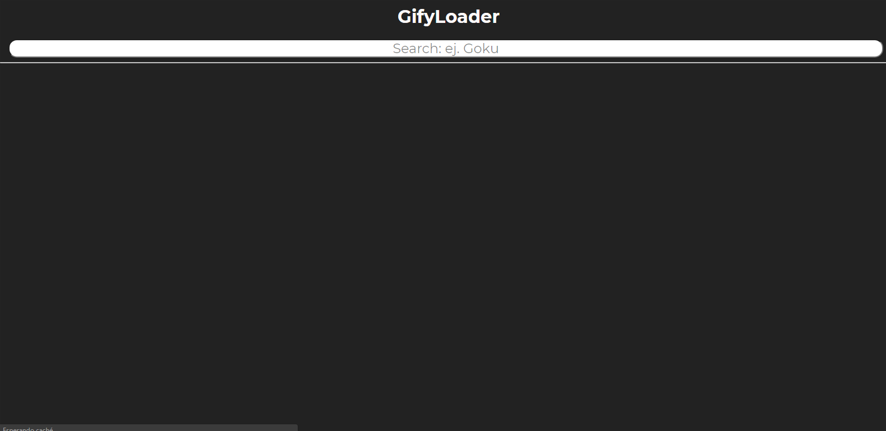
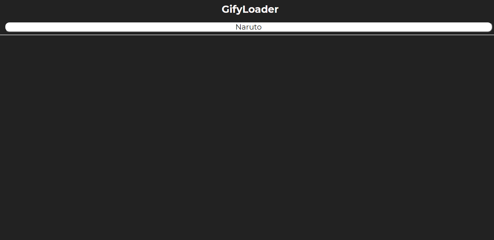
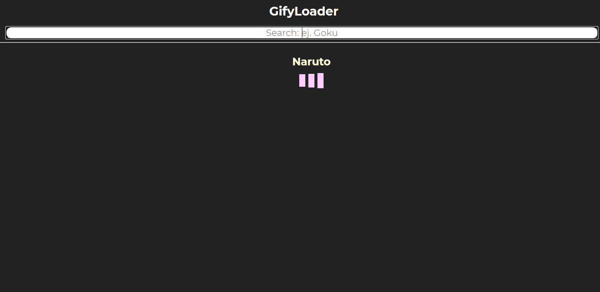
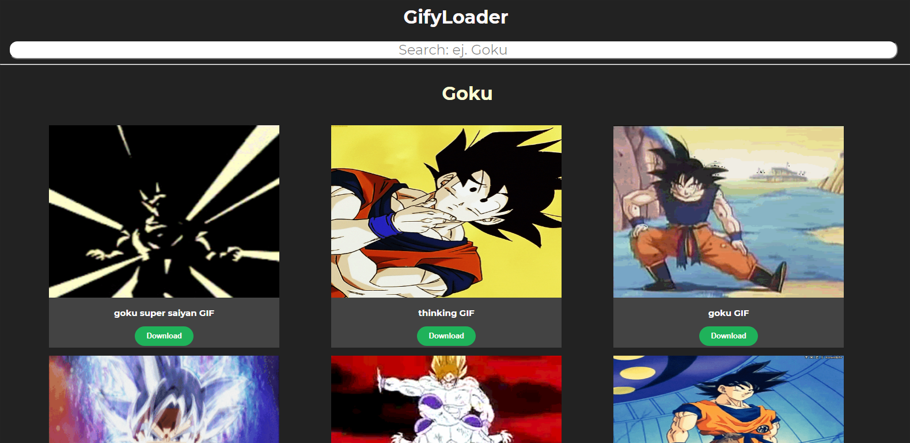

# Gify Loader

Este proyecto es desarrollado con tecnologías modernas como lo son [React JS](https://github.com/facebook/create-react-app), [Animate CSS](https://animate.style/), [Ox Framework](https://jos-nuxt-app.web.app/docs/introduction) [Beta] y [Pure CSS Loader](https://loading.io/css/)consumiendo el contenido de [Giphy](https://giphy.com/).

## Scripts Disponibles

Es recomendado utilizar el gestor de dependencias [Yarn](https://yarnpkg.com/) para este proyecto, debido a que el mezclar gestores puede ocasionar problemas en el mismo.

Para ejecutar los scripts, deberas situarte sobre la carpeta del proyecto utilizando tu linea de comandos que prefieras, y ejecutando los siguientes scripts.

### `yarn start`

Iniciara la App en modo desarrollo.\
Abrira automaticamente la ruta [http://localhost:3000](http://localhost:3000) en tu navegador predeterminado y en el podras ver en tiempo real los cambios en el mismo.

No es necesario recargar la página constantemente, React se encargara de eso.\

### `yarn test`

En caso de que tengas Test y quieras correrlos, podras analizar estos test de manera automatica y en tiempo real.\

### `yarn build`

Contruir tu aplicación es el ultimo paso antes de pasar a un entorno de producción, por lo que cuando tu aplicación este lista para ser desplegada al mundo y solo en ese momento, ejecuta este comando, el cual creara una carpeta `build` que es la que deberas subir a tu servicio de Hosting.\

### `yarn deploy`

Alternativamente de crear tu carpeta build manualmente, puedes utilizar la dependencia de [`gh-pages`](https://yarnpkg.com/package/gh-pages) y este comando, sin embargo deberas preconfigurar tu archivo `package.json` agregando los siguientes comandos en el area de `scripts`

`"predeploy": "yarn build", "deploy": "gh-pages -d build"`

## Screenshots

